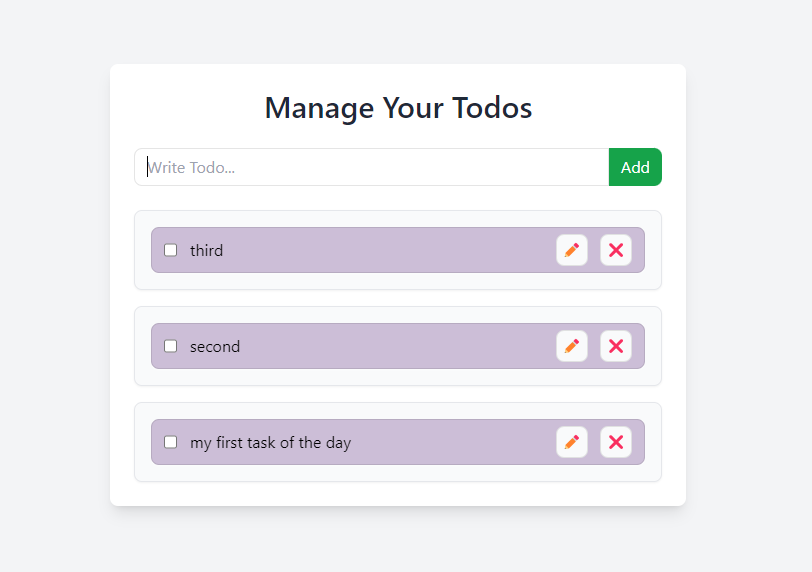

Here's a sample `README.md` file for your Todo application:

```markdown
# Todo Management Application

This is a simple Todo Management Application built using React and styled with Tailwind CSS. The app allows users to manage their tasks efficiently by adding, updating, deleting, and marking tasks as complete.

## Features

- **Add Todo**: Users can add new todos to the list.
- **Update Todo**: Existing todos can be updated.
- **Delete Todo**: Unwanted todos can be removed.
- **Toggle Complete**: Users can mark todos as complete or incomplete.

## Screenshot

Here is a screenshot of the Todo Management Application:



## Project Structure

The project is structured as follows:
```

/src
├── components
│ ├── TodoForm.js # Component for adding a new todo
│ ├── TodoItem.js # Component for displaying a single todo item
│ └── TodoProvider.js # Context provider for managing todos
├── App.js # Main application component
└── index.js # Entry point of the application

````

## Tailwind CSS

The application uses Tailwind CSS for styling. The design is responsive and minimalistic, ensuring a clean and user-friendly interface.

### Key Tailwind Classes Used

- **Container**:
  - `bg-gray-100`: Light gray background for the entire screen.
  - `min-h-screen`: Ensures the container takes up the full height of the viewport.
  - `flex items-center justify-center`: Centers the content both vertically and horizontally.
  - `py-12`: Adds padding on the top and bottom.

- **Card**:
  - `bg-white`: White background for the main card.
  - `w-full max-w-xl`: Responsive width with a max width on larger screens.
  - `shadow-lg`: Large shadow for depth.
  - `rounded-lg`: Rounded corners for a modern look.
  - `p-6`: Padding for spacing inside the card.

- **Title**:
  - `text-3xl`: Large font size for the title.
  - `font-semibold`: Semi-bold font weight.
  - `text-center`: Centers the title.
  - `text-gray-800`: Dark gray color for the title text.
  - `mb-6`: Margin for spacing.

- **Todo Item**:
  - `bg-gray-50`: Light gray background for individual todo items.
  - `p-4`: Padding for spacing within each item.
  - `rounded-lg`: Rounded corners for a modern appearance.
  - `border border-gray-200`: Subtle border around each item.
  - `shadow-sm`: Small shadow for slight elevation.

## Getting Started

To get started with the project, follow the instructions below:

### Prerequisites

- [Node.js](https://nodejs.org/) installed on your machine.
- [npm](https://www.npmjs.com/) or [yarn](https://yarnpkg.com/) as a package manager.

### Installation

1. Clone the repository:

   ```bash
   git clone use  url of todo repo
   cd To-DO  Rect
````

2. Install the dependencies:

   ```bash
   npm install
   # or
   yarn install
   ```

3. Start the development server:

   ```bash
   npm start
   # or
   yarn start
   ```

4. Open your browser and navigate to `http://localhost:{portno}` to see the app in action.

## Usage

- **Add a Todo**: Use the form at the top of the page to add a new task.
- **Update a Todo**: Click on a todo item to edit its details.
- **Delete a Todo**: Click the delete button on a todo item to remove it.
- **Toggle Complete**: Click on the checkbox to mark a todo as complete or incomplete.

## Contributing

Contributions are welcome! Please feel free to submit a pull request or open an issue to discuss any changes or improvements.

## Acknowledgments

- Thanks to the React and Tailwind CSS communities for their excellent tools and resources.

```

```
